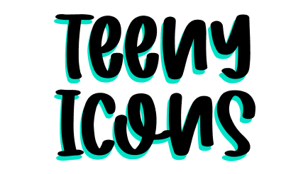

<h1 align="center">

</h1>

## Why Teenyicons?
Designed on a *15x15* grid, Teenyicons easily fit in very *small spaces* 🤏 and maintain a *crisp look* ✨

## Install

```bash
npm i teenyicons
yarn add teenyicons
```

## Usage

### Inline

Copy the SVGs you wish to use from `outline` and `solid` directories inside `node_modules/teenyicons` and inline them in your HTML. Use CSS's `color` to change the SVG's color.
```xml
<svg class="w-4 h-4 text-white" viewBox="0 0 15 15" fill="none" xmlns="http://www.w3.org/2000/svg">
  <path d="M0 1.5h1.5a6 6 0 110 12H0m7-12h4.5a3 3 0 110 6m0 0H9m2.5 0h-2m2 0a3 3 0 110 6H7" stroke="currentColor"/>
</svg>
```

## Request an icon

Requests are very welcome. Open an [issue](https://github.com/teenyicons/teenyicons).

## License

Teenyicons is released under the [MIT License](LICENSE).